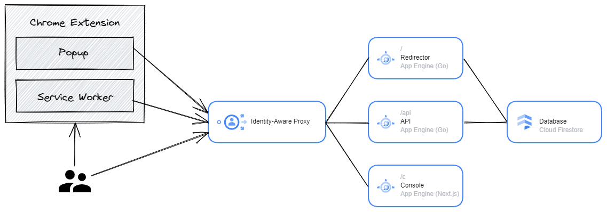

# Design Doc

**This doc is outdated. Please refer to [GitHub Issues](https://github.com/nownabe/golink/issues?q=is%3Aissue) for tracking changes.**

## Context

See [PRD](./PRD.md).

## Terminology

- **Golink**: the whole system of this Golink
- **golink**: a definition of a redirect, which is composed of its name and a target url to redirect

## Overview

Golink consists of six components: Chrome extension, API, Redirector, database, Identity-Aware Proxy, Console.

[](https://googlecloudcheatsheet.withgoogle.com/architecture?link=0038ca10-313a-11ee-82a6-f9c22e3525da)

Server-side components are built on Google Cloud.
Clients, Chrome Extension and Console, communicate with API via gRPC.

Chrome extension has two roles: First, the service worker interrupts requests to `http://go/*` and redirects to Redirector. Second, the popup provides quick operations for golinks, such as creating a new golink.

## Detailed Design

### Infrastructure

As the diagram above shows, all server-side components are built on Google Cloud.

Redirector, API, and Console are hosted on Google App Engine and `dispatch.yaml` dispatches requests to each service.
The database is Cloud Firestore, which is used by Redirector and API.
These App Engine services are protected by Identity-Aware Proxy, so Golink users needs to sign in.

### gRPC

Methods and the Golink message are as follow.

```protobuf
service GolinkService {
  rpc CreateGolink(CreateGolinkRequest) returns (CreateGolinkResponse) {}
  rpc GetGolink(GetGolinkRequest) returns (GetGolinkResponse) {}
  rpc ListGolinks(ListGolinksRequest) returns (ListGolinksResponse) {}
  rpc ListGolinksByUrl(ListGolinksByUrlRequest) returns (ListGolinksByUrlResponse) {}
  rpc UpdateGolink(UpdateGolinkRequest) returns (UpdateGolinkResponse) {}
  rpc DeleteGolink(DeleteGolinkRequest) returns (DeleteGolinkResponse) {}
  rpc AddOwner(AddOwnerRequest) returns (AddOwnerResponse) {}
  rpc RemoveOwner(RemoveOwnerRequest) returns (RemoveOwnerResponse) {}
}

message Golink {
  string name = 1;
  string url = 2;
  repeated string owners = 3;
}
```

I'll use [connect](https://connectrpc.com/) as gRPC implementation because connect works on App Engine and doesn't need a proxy for communication with browsers.

#### `CreateGolink` method

```proto
message CreateGolinkRequest {
  string name = 1;
  string url = 2;
}

message CreateGolinkResponse {
  Golink golink = 1;
}
```

`CreateGoink` creates a new golink by a name and a URL. If the given name is already taken, `CreateGolink` returns an `ALREADY_EXISTS` error.
`CreateGolink` is used by both Console and Extension.

Values of `name` must be valid. It follows [Firestore limitations](https://firebase.google.com/docs/firestore/quotas#collections_documents_and_fields) ans Golink rules:

* name cannot start or end with `"-"`. (these names are reserved by Golink)
* name cannot be `"api"` or `"c"`.
* name cannot be `"_"`.

Names are case insensitive.

#### `GetGolink` method

```proto
message GetGolinkRequest {
  string name = 1;
}

message GetGolinkResponse {
  Golink golink = 1;
}
```

`GetGolink` gets a golink by its name. If no golink is found by the given name, `GetGolink` returns a `NOT_FOUND` error.
`GetGolink` is used by Console.

#### `ListGolinks` method

```proto
message ListGolinksRequest {
}

message ListGolinksResponse {
  repeated Golink golinks = 1;
}
```

`ListGolinks` returns golinks that the user owns.
`ListGolinks` is used by Console.

#### `ListGolinksByUrl` method

```proto
message ListGolinksByURLRequest {
  string url = 1;
}

message ListGolinksByURLResponse {
  repeated Golink golinks = 1;
}
```

`ListGolinksByUrl` returns golinks associated to the given URL.
`ListGolinksByUrl` is used by Extension.

**Note**: "Url" or "URL"? It is mentiond in [Google's API design guide](https://cloud.google.com/apis/design/naming_convention#camel_case) that except for field names and enum values, all names must be UpperCamelCase, as defined by [Google Java Style](https://google.github.io/styleguide/javaguide.html#s5.3-camel-case).

#### `UpdateGolink` method

```proto
message UpdateGolinkRequest {
  string name = 1;
  string url = 2;
}

message UpdateGolinkResponse {
  Golink golink = 1;
}
```

`UpdateGolink` updates the URL of a specified golink. If the user is not the owner of the golink, `UpdateGolink` returns a `PERMISSION_DENIED` error.
`UpdateGolink` is used by Console.

#### `DeleteGolink` method

```proto
message DeleteGolinkRequest {
  string name = 1;
}

message DeleteGolinkResponse {
}
```

`DeleteGolink` deletes a golink by its name. If the user is not the owner of the golink, `DeleteGolink` returns a `PERMISSION_DENIED` error.
`DeleteGolink` is used by Console.

#### `AddOwner` method

```proto
message AddOwnerRequest {
  string name = 1;
  string owner = 2;
}

message AddOwnerResponse {
  Golink golink = 1;
}
```

`AddOwner` adds a new owner given as an email. If the request user is not an owner of the golink, `AddOwner` returns a `PERMISSION_DENIED` error.
`AddOwner` is used by Console.

#### `RemoveOwner` methods

```proto
message RemoveOwnerRequest {
  string name = 1;
  string owner = 2;
}

message RemoveOwnerResponse {
  Golink golink = 1;
}
```

`DeleteOwner` remove a specified owner given as an email from a golink. If the request user is not an owner of the golink, `DeleteOwner` returns a `PERMISSION_DENIED` error.
If the request user is the last owner of the golink, `DeleteOwner` returns a `FAILED_PRECONDITION` error.
`DeleteOwner` is used by Console.

### Database

There are only an object type, Golink. Golink documents are stored `golinks/` collection and identified by golink name.

```json
// golinks/ collection
{
  "linkname1": {
    "name": "LinkName1",
    "url": "http://example.com/foo",
    "redirect_count": 10,
    "created_at": "...",
    "updated_at": "...",
    "owners": [
      "owner1@example.com",
      "owner2@example.com"
    ]
  },
  "linkname2": { ... }
}
```

Each gRPC method runs following queries:

```go
// CreateGolink, GetGolink, UpdateGolink, DeleteGolink, AddOwner, DeleteOwner
client.Collection("golinks").Doc(linkName);

// ListGolinks
client.Collection("golinks").Where("owners", "array-contains-any", userEmail);

// ListGolinksByUrl
client.Collection("golinks").Where("url", "==", url);
```

### Identity-Aware Proxy

Deployed Golink system is designed to be protected by [Identity-Aware Proxy](https://cloud.google.com/iap). Golink administrators can specify users who can access their Golink.

Identity-Aware Proxy has to configured to [allow preflight requests](https://cloud.google.com/iap/docs/customizing#allowing_http_options_requests_cors_preflight).

### API

API is a gRPC server written in Go deployed to App Engine as service. API handles requests with path prefix `/api`.

### Redirector

Redirector redirects all requests following redirect rules stored in database, counting successful redirects. If no rule is found for the given name, redirect to Console to encourage the user to create a new golink.

### Chrome Extension

Golink Chrome Extension is composed of Service Worker, Popup and Options. It's built on [Manifest V3](https://developer.chrome.com/docs/extensions/mv3/intro/).

In Options, users can configure their own Golink backend URL, which means App Engine's URL. Golink backend URL configured in Options is stored [storage sync](https://developer.chrome.com/docs/extensions/reference/storage/#property-sync) so that users can use the URL in any Chrome they signed in.

Service Worker interrupts requests to `http://go/*` and redirects them to Redirector. On Manifest V3, using [declarativeNetRequest](https://developer.chrome.com/docs/extensions/reference/declarativeNetRequest/) is required to redirect. Since target URL to redirect is dynamically configured in Options by users, Golink needs to use dynamic rules instead of static rules cannot be eligible for Golink.

Popup provides quick UI to create a new golink to the current URL. Popup calls Golink APIs to create new golinks and to list golinks related to the current tab's URL. For quick creation, Popup gets the URL of the current tab and fill it in Popup's form. Popup needs client code generated from gRPC definitions to call API, and cookies to access API through IAP. If users don't signed in, users have to be redirected to sign-in dialogue.

To provide these features, Golink Chrome Extension needs permissions: `declarativeNetRequest`, `storage` and `tabs`.

As development logistics, I chose TypeScript to keep benefits of types from gRPC, Parcel for zero-configuration builds.

### Console (Web Frontend)

Console is web UI to give users all features of Golink.

It is built with Next.js and hosted on App Engine as `console` service at `/c`.

### App Engine's Dispatcher

App Engine dispatches each request to each service following `dispatch.yaml`.

```yaml
dispatch:
  - url: "*/api/*"
    service: api
  - url: "*/c/*"
    service: c
  - url: "*/*"
    service: default
```

## Alternatives Considered

## Caveats

- Cloud Firestore has a [limitation](https://cloud.google.com/firestore/docs/manage-data/add-data#increment_a_numeric_value) that a single document can be updated only once per second. As Redirector counts how many redirects happened for each golink, if a Golink grows too much, it has to use [distributed counters](https://cloud.google.com/firestore/docs/solutions/counters) or throttling.
