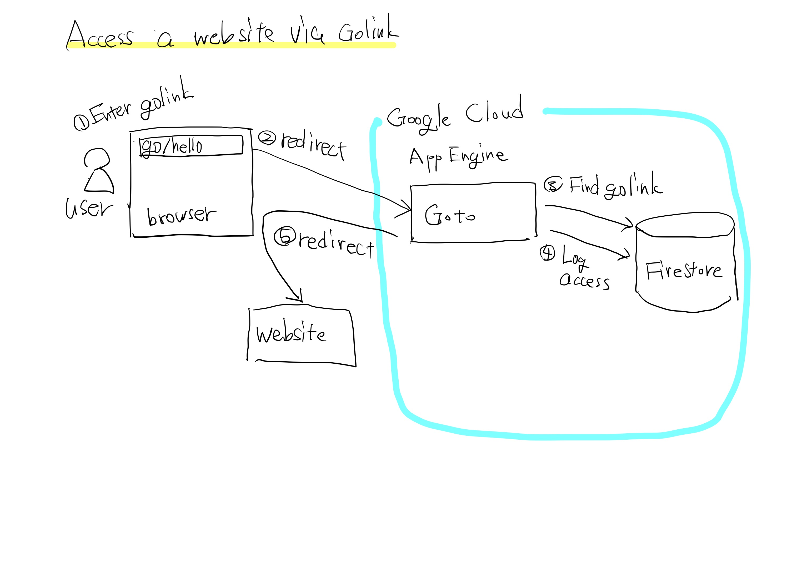
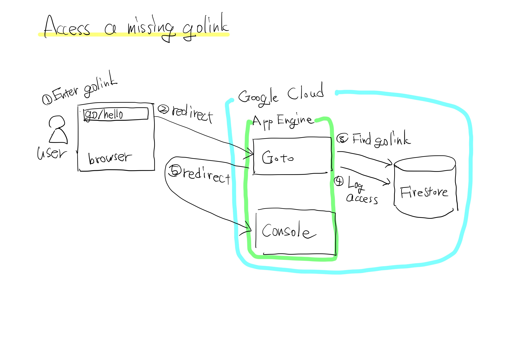
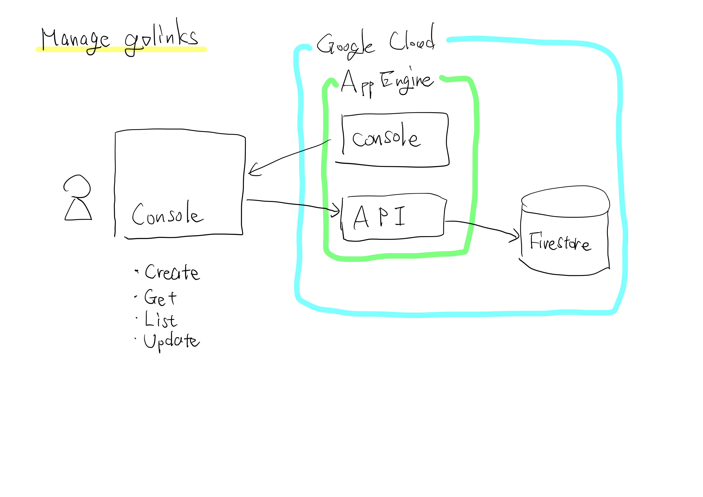
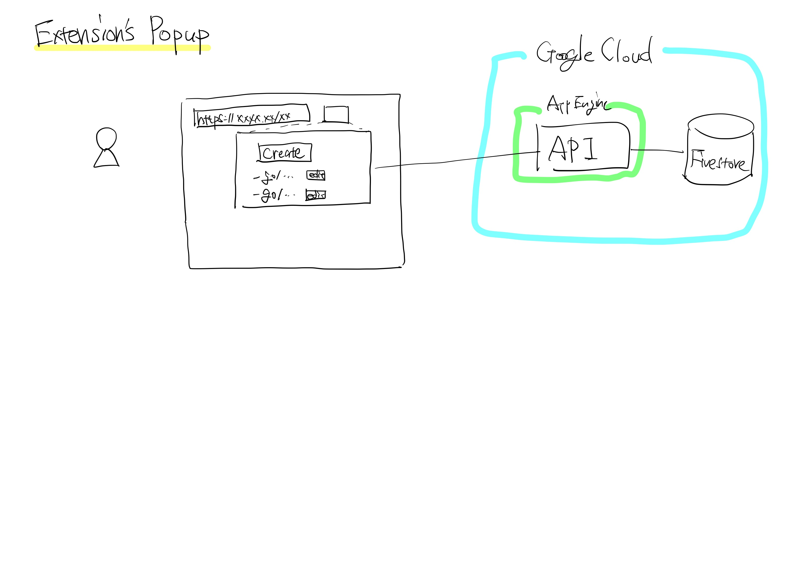

# Product Requirements Document

## Overview

Golink makes it easy for Internet users to access websites with long URLs or those that are hard to find in the bookmarks.
By simply typing `go/linkname` into the address bar, users can quickly open the desired website.

Golink may seem like a typical URL shortener, but what sets it apart is its ability to create custom scopes, like those for your company.

## Background

Accessing websites is more tedious and boring than you might think.
Normally, when you try to access a website, you end up for searching for the same page repeatedly on a search engine, going through an index page, looking through your numerous bookmarks, or trying to type keywords into the address bar, relying on unreliable memory.

## Objectives

The aim of Golink is to improve productivity by providing faster and easier, single-hop website access.
It eliminates the need for unnecessary tasks to open websites and saves both your brain resource required to remember website locations and your hand resources needed to type URLs or search keywords.

- Users can access websites only by typing `go/linkname` in the address bar
- Users can list and manage golinks in the console

## Personas

- User
  - A user who open the same website repeatedly in their daily work/life
- Administrator
  - An administrator who deploy and operate the Golink system

## Critical User Journeys

### Go to a website

- Persona: User
- Tasks:
  1. Type a golink like `go/linkname` and push the enter key

### Deploy Golink

- Persona: Administrator
- Tasks:
  1. Clone this repository
  2. Run setup script

## Requirements

- Users
  - Google Chrome to browse
  - Google accounts
- Administrators
  - Google Cloud to host backends
  - asdf or required tools to deploy

## High Level Architecture

### Components

Golink consists of four components, Chrome extension, Redirector, API, and Console.
Redirector, API and Console are deployed to Google App Engine for each company or for each user.
A host `golink.example.com` used below is an example host for a user's own URL for Golink backends.

#### Chrome Extension

Golink Chrome extension redirects `http://go/linkname` to `https://golink.example.com/linkname`.
Golink also provides a popup interface to create a new golink to the URL of the current tab, and to list golinks related to the URL.

The host for each user can be configured in extension's option.

#### Redirector

Redirector is hosted on `https://golink.example.com/`.
Redirector is responsible for redirecting users' requests to true URLs.

#### API

API is hosted on `https://golink.example.com/api/`.
API is the API to manage golinks.

#### Console

Console is hosted on `https://golink.example.com/c/`.
Console is the web based UI to mange golinks.

### Security

Security is important for Golink because Golink is intended to be used in a closed environment like companies.
Golink has two security functionalities.

1. Only whitelisted users can access Redirector, API, Console.
2. Those who don't have ownership permission of a golink cannot edit or delete the golink.

## Alternatives

- [GoLinks® | Knowledge Discovery & Link Management Platform](https://www.golinks.io/)
- [Trotto - Open-Source Go Links](https://www.trot.to/)
- [tailscale/golink: A private shortlink service for tailnets](https://github.com/tailscale/golink)

### Differentiation

- Open source
- Self-host; not a SaaS and no pricing
- Built on Google Cloud as fully managed

## Appendix

